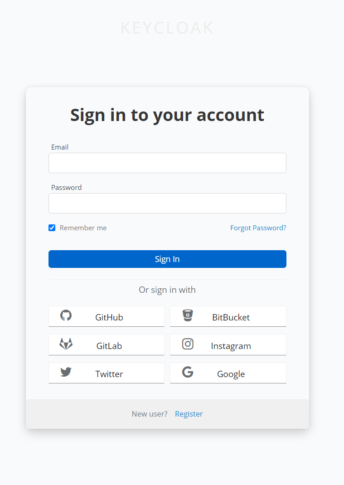
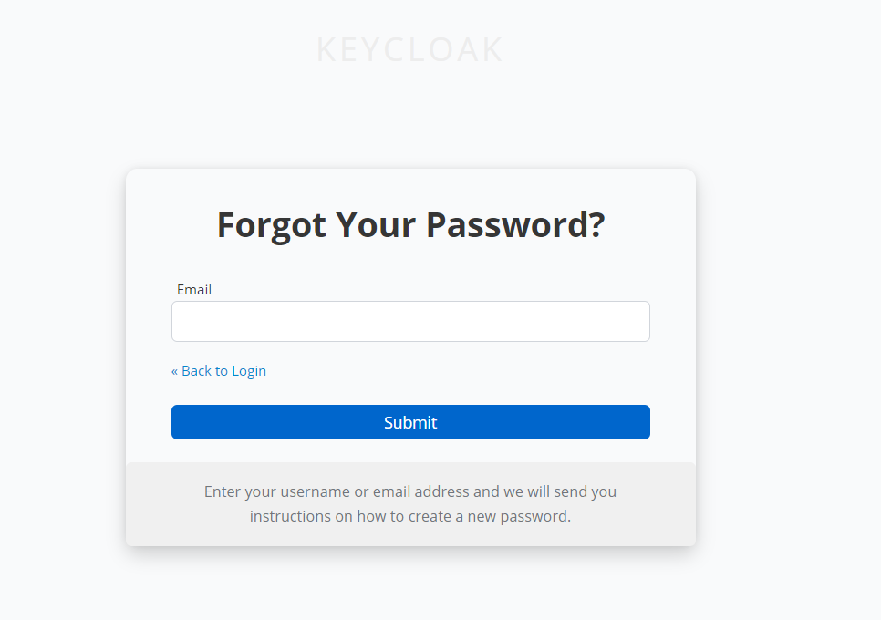
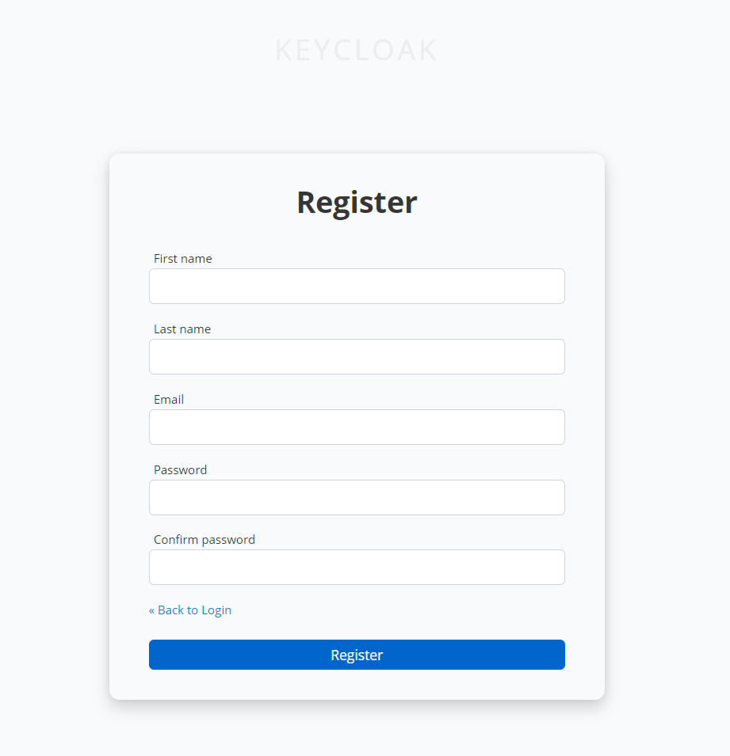

# Keycloak Theming (19.0)

Just a small example how to theme Keycloak 19.0 as docker deployment. You can find the detailed here: [Documentation](https://www.keycloak.org/docs/latest/server_development/index.html#_themes)

There are two ways to achieve custom theming: You could mount a folder/volume build the image yourself.

## Building the image yourself

```Dockerfile
FROM quay.io/keycloak/keycloak:19.0

COPY ./themes/veith /opt/keycloak/themes/veith
```

## Mounting a folder/volume

```yml
    volumes:
      - ./themes/veith:/opt/keycloak/themes/veith
```

The custom theme in this repository looks like this:




